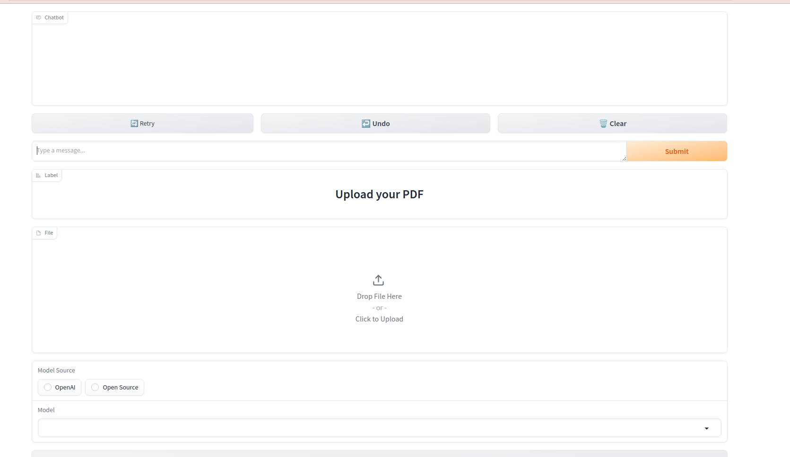
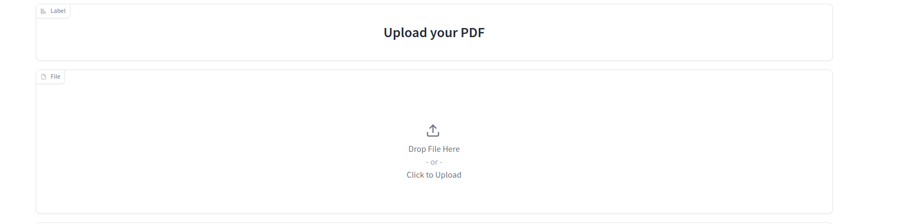
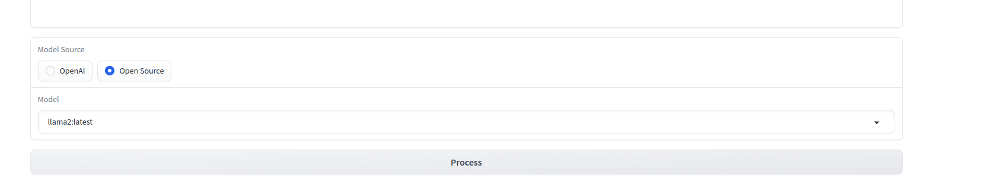
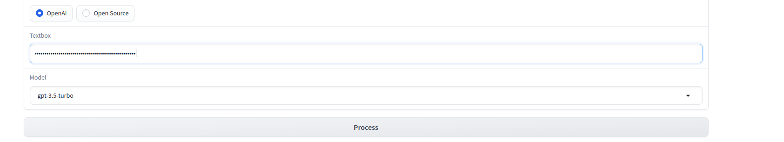
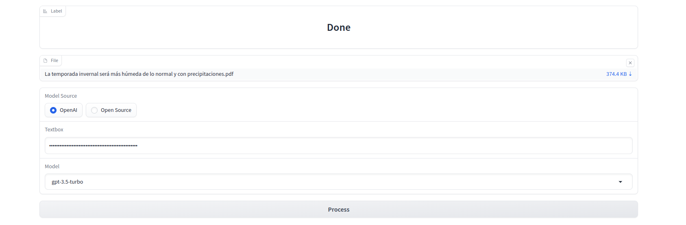
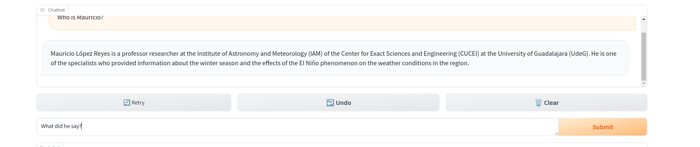

# MultiPDF Chat App

## Introduction
------------
The Chat With PDF App is a Python application that allows you to chat with a PDF documents. You can ask questions about the PDF using natural language, and the application will provide relevant responses based on the content of the documents. This app utilizes a language model to generate accurate answers to your queries. Please note that the app will only respond to questions related to the loaded PDF.

## Dependencies and Installation
----------------------------
To install the Chat With PDF App, please follow these steps:
1. Download [Ollama library](https://github.com/jmorganca/ollama)
   ```
   curl https://ollama.ai/install.sh | sh
   ```
2. pull the chat models we will use [LLAMA2](https://ollama.ai/library/llama2), [MISTRAL](https://ollama.ai/library/mistral), [GEMMA](https://ollama.ai/library/gemma)
   ```
   ollama pull llama2
   ```
   ```
   ollama pull mistral
   ```
   ```
   ollama pull gemma
   ```
3. Create new enviroment with python 3.9 and activate it, in this case we will use conda
   ```
   conda create -n cwp python=3.9
   ```
   ```
   conda activate cwp
   ```


4. Clone the repository to your local machine.
   ```
   git clone https://github.com/jorge-armando-navarro-flores/chat_with_PDF.git
   ```
   ```
   cd chat_with_PDF
   ```

5. Install the required dependencies by running the following command:
   ```
   pip install -r requirements.txt
   ```


## Usage
-----
To use the Chat With PDF app, follow these steps:

1. Run the `main.py` file using the Streamlit CLI. Execute the following command:
   ```
   python3 main.py
   ```

2. The application will launch in your default web browser, displaying the user interface.


3. Load your PDF into the app by following the provided instructions.


4. Choose LLM source.


5. If you choose OpenAI source you will need to provide your OPENAI_API_KEY. you can get it [here](https://openai.com/blog/openai-api)


6. Click the process button and wait label say Done


7. Ask questions in natural language about the loaded PDFs using the chat interface.

